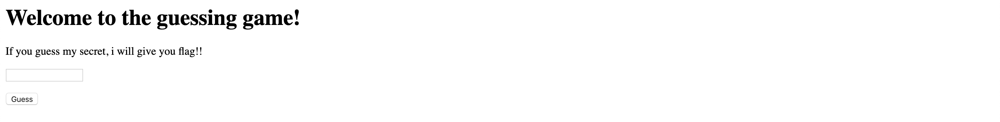

## [Enough PHP magic](https://ctf.viblo.asia/puzzles/enough-php-magic-qtd1odoekwl)

Ta scan thử => tìm được file index.phps và mã nguồn như sau:

Ta chú ý hàm **extract** nó sẽ nhận vào 1 mảng và trích xuất mảng tạo ra các biến

Vì thế ta có thể thay đổi `$filename` thành rỗng và từ đó `$combination` cũng rỗng khiến `$attempt` = ` $combination`

Payload: http://172.104.49.143:1307/index.php?filename=&attempt

`Flag{extract_is_not_safe}`