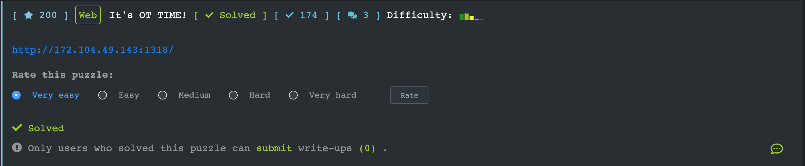
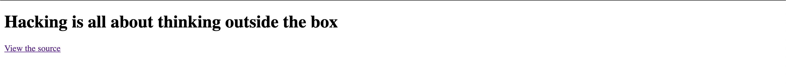
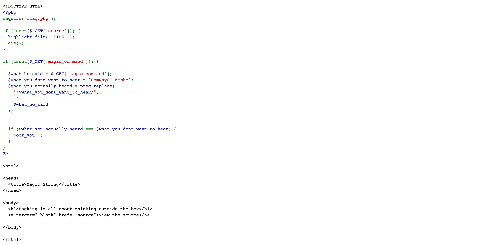

## [It's OT TIME!](https://ctf.viblo.asia/puzzles/it-s-ot-time-pofkh4esw6w)

***

Truy cập vào link ở <u>View_the_source</u> ta có mã nguồn của index.php

Bài này bypass regex, cũng khá là đơn giản. Hàm **preg_replace** trong php sẽ replace 1 chuỗi thành chuỗi khác theo biểu thức chính quy (regular expression)

Ví dụ: magic_command là **HomNayOT_EmNhe** thì nó sẽ replace và magic_command sẽ bằng rỗng.

Ta có thể lặp lại chuỗi **HomNayOT_EmNhe** vào trong chính chuỗi đó để bypass

=> Payload: http://172.104.49.143:1318/?magic_command=HomNayOTHomNayOT_EmNhe_EmNhe

`Flag{V4ng_4nh_cu0c_s0ng_m4}`