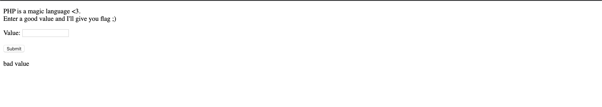
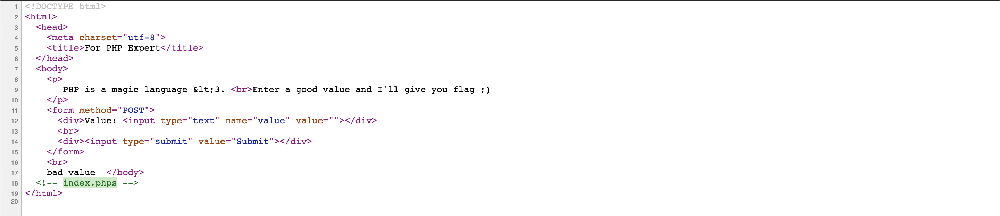
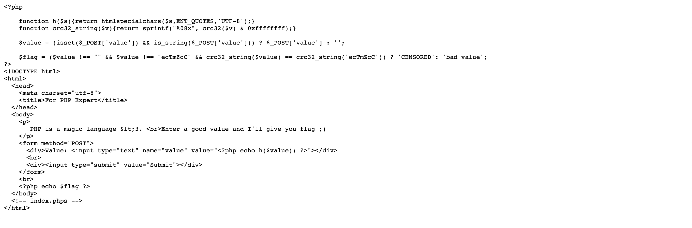

## [MagiC PhP](https://ctf.viblo.asia/puzzles/magic-php-t0dnftx3ter)








Theo như code thì nó sẽ gán giá trị của `$value` bằng giá trị của value trong phương thức POST gửi lên.

và hàm cả hàm `h($value) ` sẽ chuyển các kí tự đặc biệt trong chuỗi thành các HTML entities. Hàm crc32_string sẽ trả về 1 chuỗi băm crc có độ dài 32bit từ chuỗi `$v` . Cuối cùng thì nó sẽ kiểm tra giá trị của $value khác rỗng, khác “ecTmZcC” và chuỗi băm tạo ra phải khác với giá trị của chuỗi băm sinh từ chuỗi “ezTmZcC”. Nhưng khi so sánh thì tác giả sử dụng `==` đây là 1 toán tử có thể tạo ra lỗi **Type Juggling**

Chuỗi băm của “ecTmZcC là 0e730435 mà vì nó đang mắc lỗi `Type Juggling` nên ta chỉ cần tìm 1 chuỗi khi băm ra có dạng “0e…” là có thể vượt qua. Sử dụng đoạn mã PHP này để gen ra payload:

```php
<?php

function crc32_string($v){
	return sprintf("%08x", crc32($v) & 0xffffffff);
}

function genRand(){
	$chars = "0123456789abcdefghijklmnopqrstuvwxyzABCDEFGHIJKLMNOPQRSTUVWXYZ";
	$newStr = "";
	for($i = 0; $i < 7; $i++){
		$newStr .= $chars[rand(0,strlen($chars) - 1)];
	}
	return $newStr;
}

while(1){
	$rand = genRand();
	$str = crc32_string($rand);
	if(preg_match("/0e[0-9]{6}/", $str)){
		var_dump($str);
		var_dump($rand);
		die();
	}
}
```

=> Payload: AWib9e5 chuỗi gen ra là 0e153696

>  **Cách thứ 2** đơn giản hơn đó là sử dụng bảng magic hash ở [link này](https://www.whitehatsec.com/blog/magic-hashes/) và payload là: 6586

`Flag{php_magic_type_casting_or_did_you_brute_force_it?}`