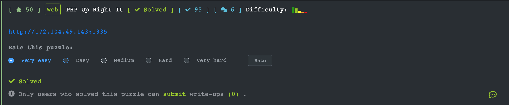
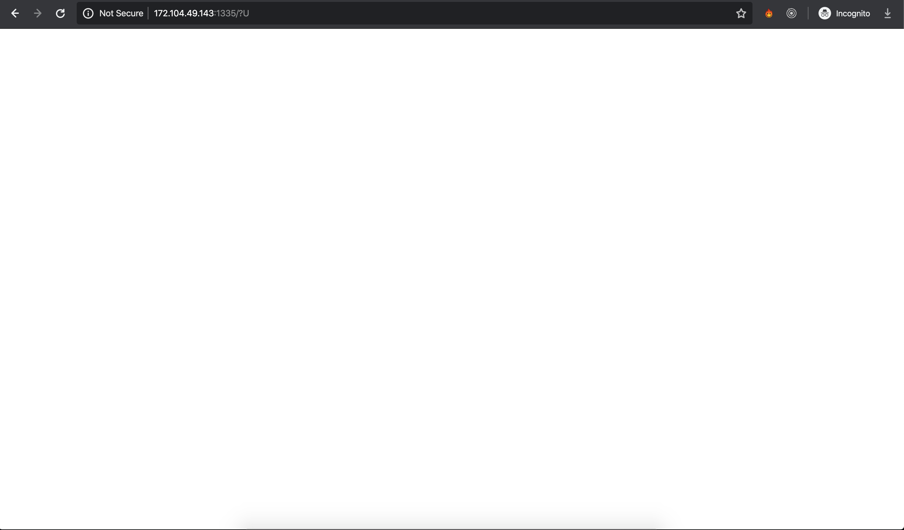
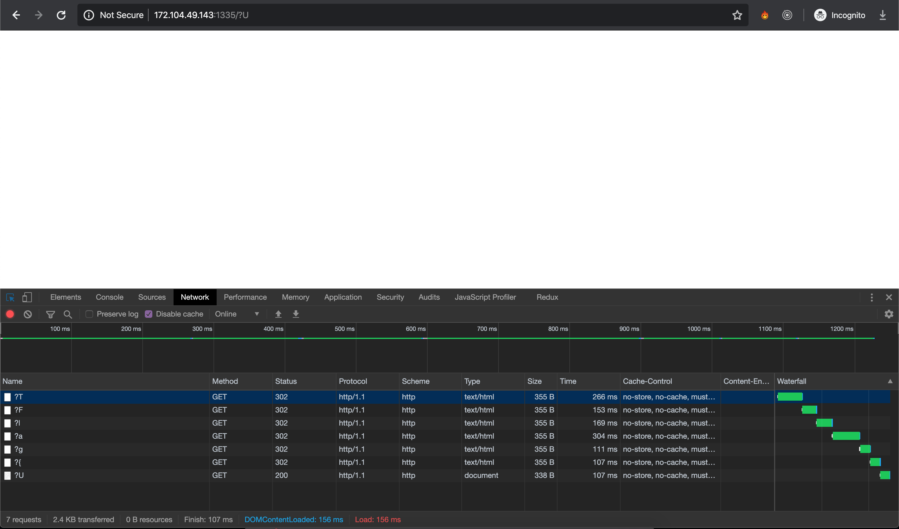

## [PHP Up Right It](https://ctf.viblo.asia/puzzles/php-up-right-it-x1g34zp8knu)

Khi truy cập vào thì là 1 trang trắng

Tuy nhiên có thể để ý thấy query ở link. Sau khi refresh 1 vài lần với Network tool của Chrome DevTools chúng ta có thể thấy rất nhiều query parameters và mỗi chuỗi đó chính là 1 kí tự trong flag => Sau khi nối lại ta được flag: `Flag{URI_is_Import@nT}`

