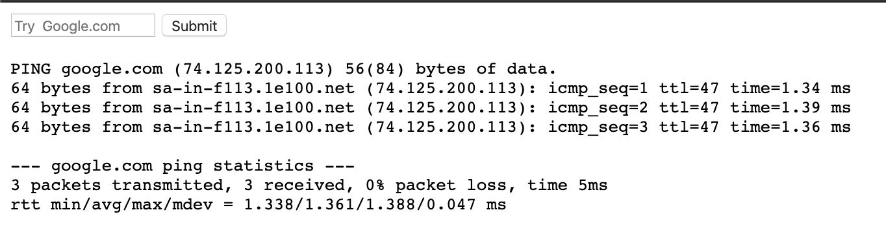
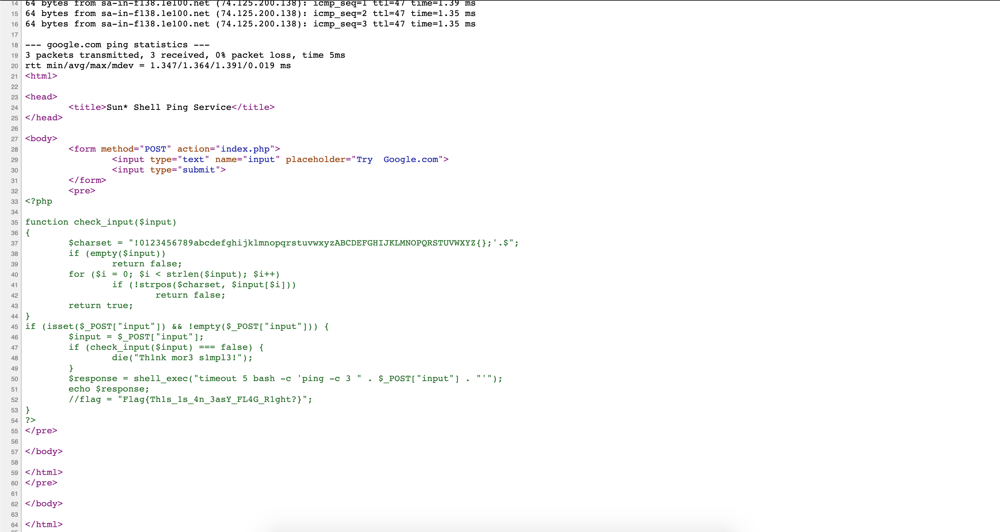

## [Sun* Service](https://ctf.viblo.asia/puzzles/sun-service-knjw1vcjylx)

***

Ban đầu vào chỉ có 1 form. Ta sẽ thử truyền 1 domain hoặc ip vào:

Kết quả là đó là 1 công cụ ping

Chúng ta thử **google.com;cat index.php** tuy nhiên nó đã chặn space => ta bypass bằng **google.com;cat${IFS}index.php**

Trong đó **${IFS}** là 1 biến đặc biệt trong shell (**Internal Field Separator**) giá trị mặc định của nó là: **space, tab** hoặc **newline**

`Flag{Th1s_1s_4n_3asY_FL4G_R1ght?}`