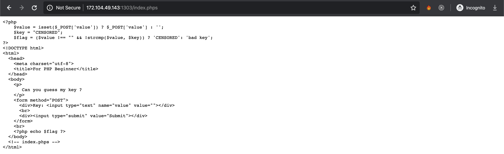
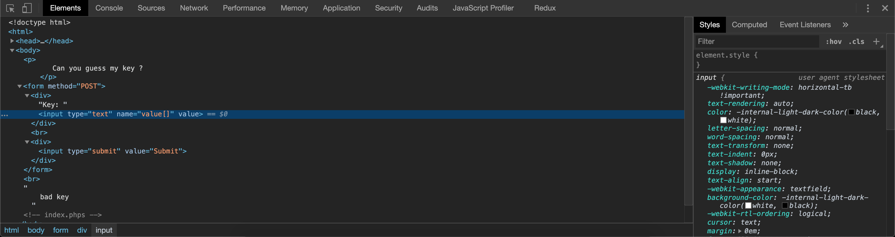

## [Tragic pHp](https://ctf.viblo.asia/puzzles/tragic-php-jjq3i6qrgkd)

Truy cập  http://172.104.49.143:1303/index.phps ta có mã nguồn của index.php. Đọc qua 1 chút thì ta xác định được là phải bypass **strcmp** của php

Có rất nhiều cách để bypass tuy nhiên mình vẫn sử dụng Chrome DevTools:

Thay đổi value thành value[] và submit form. Trong php **strcmp()** chỉ nhận tham số là 1 chuỗi, nếu truyền vào là 1 mảng sẽ gây lỗi khiến việc so sánh chuỗi luôn luôn đúng.

`Flag{dont_trust_strcmp_at_all}`