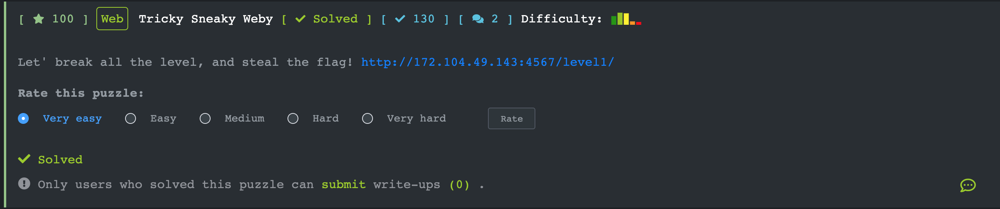
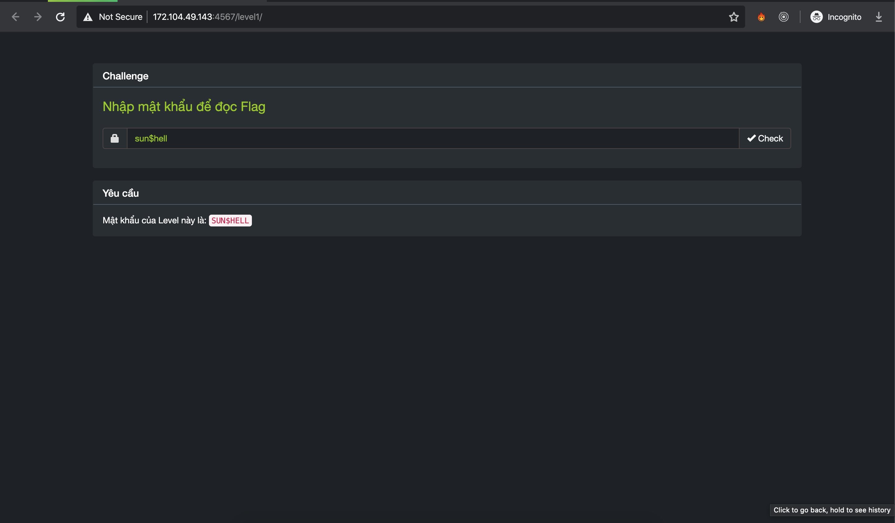
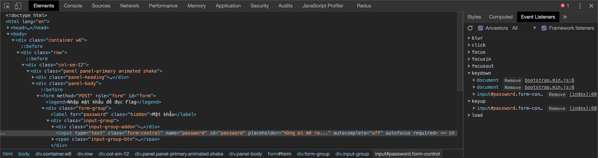
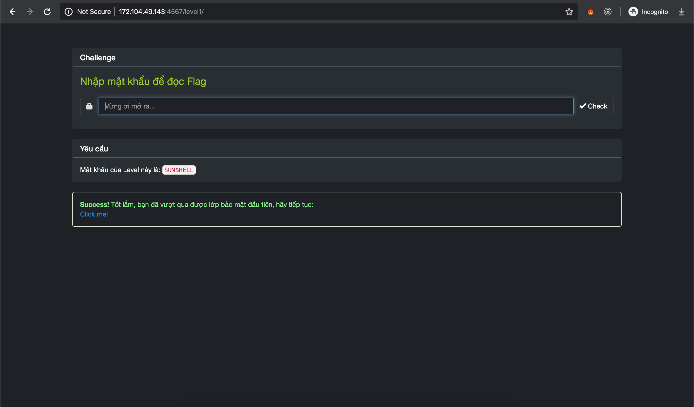
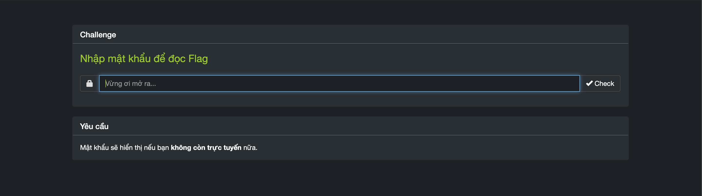
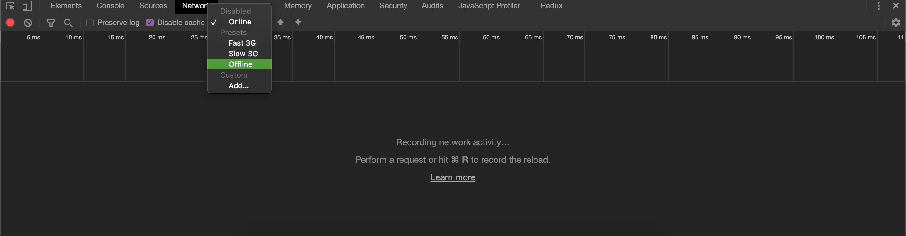
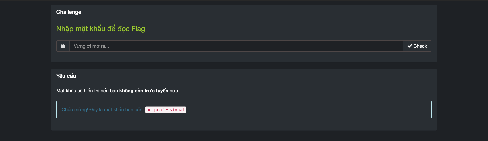
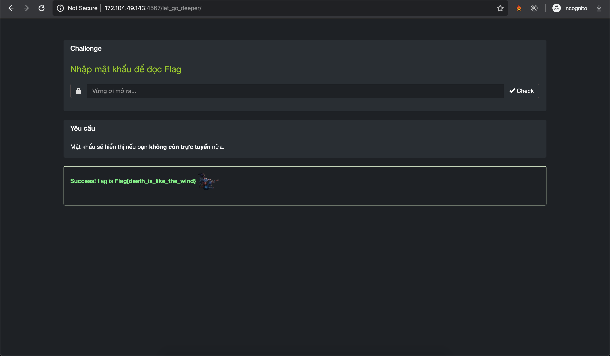
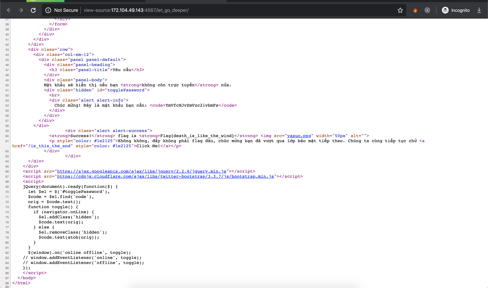
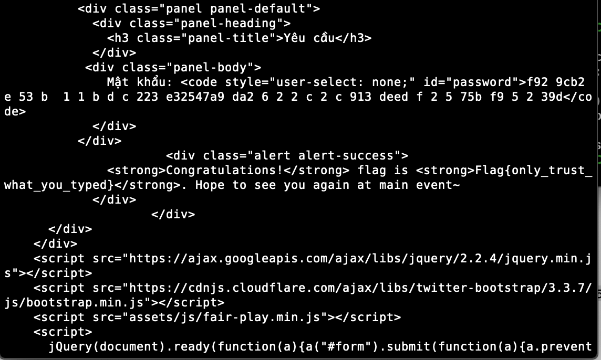

## [Tricky Sneaky Weby](https://ctf.viblo.asia/puzzles/tricky-sneaky-weby-o1y7q2psuok)



Bài này có vẻ là rất nhiều level.



Khi nhập kí tự thì toàn bộ đều trở thành dạng chữ thường thay vì chữ hoa đó là vì đoạn js:

```javascript
<script>
  jQuery(document).ready(function ($) {
  $('#password').on('keydown keyup', function () {
    $(this).val($(this).val().toLowerCase());
  });
});
</script>
```

Có rất nhiều cách để bypass tuy nhiên tôi sẽ sử dụng Chrome DevTools:



Sử dụng **Event Listeners** xoá các event keydown và keyup của input#password đi sau đó copy hoặc nhập lại chuỗi `SUN$HELL`

Oke chúng ta đã pass level 1:



Tiếp tục level 2:



Đề yêu cầu là không còn trực tuyến thì sẽ hiển thị mật khẩu. Vì vậy chúng ta lại tiếp tục sử dụng Chrome DevTools để offline







Tuy nhiên flag nhận được chỉ là fake. Chúng ta xem tiếp mã nguồn của trang



Tiếp tục với level cuối:

Với level này thì trang không cho phép bôi đen và copy trực tiếp nên chúng ta sẽ vào mã nguồn copy đoạn mã f929cb2e53b11bdc223e32547a9da2622c2c913deedf2575bf95239d và sử dụng curl để gửi POST request:


Ban đầu khi copy đoạn mã vào thì chúng có chứa **<200b>** là (Unicode Character 'ZERO WIDTH SPACE’), chúng ta chỉ cần replace all nó đi là được



`Flag{only_trust_what_you_typed}`