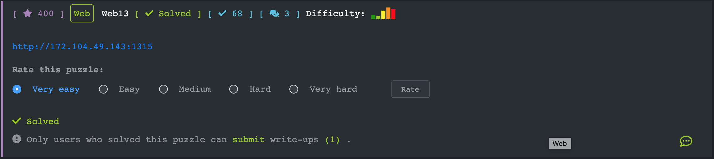
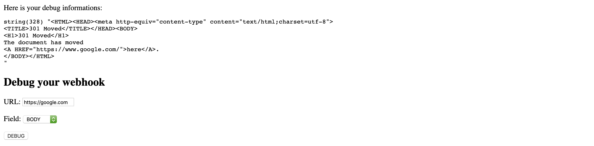
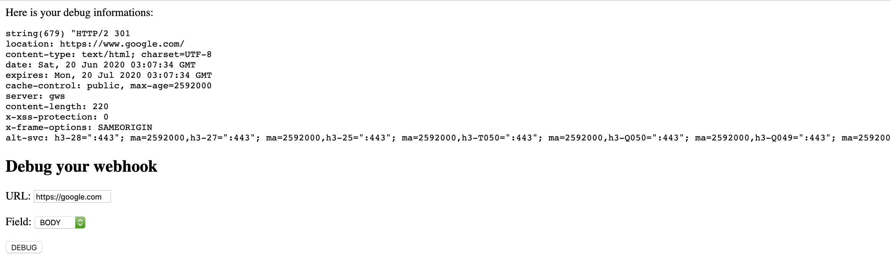
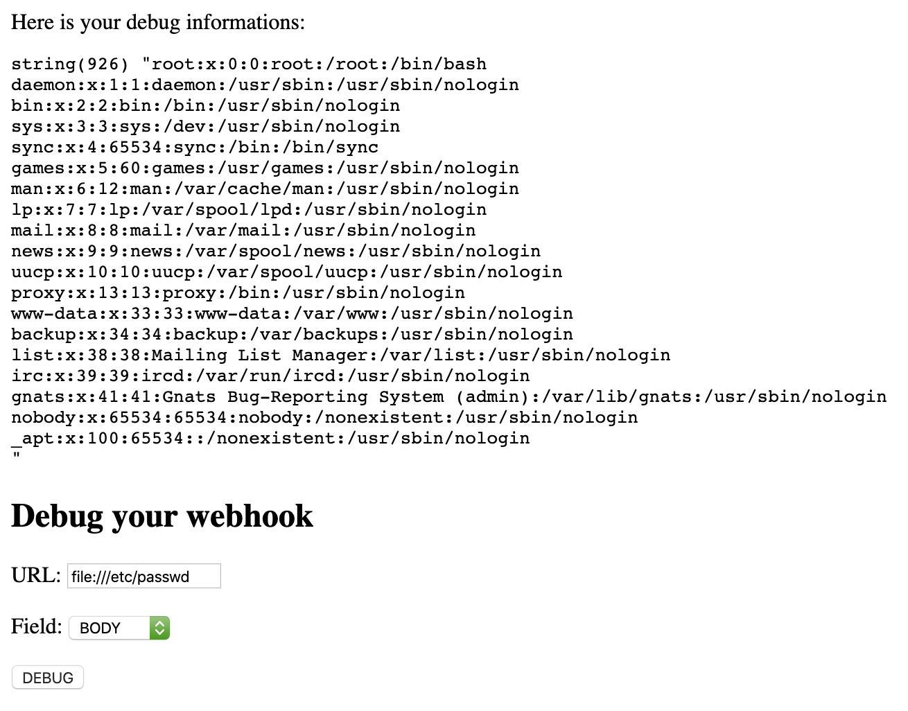
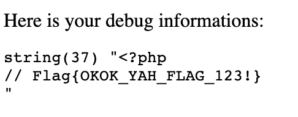

## [Web13](https://ctf.viblo.asia/puzzles/web13-hltbsx0esfz)

Ta thử LFI đọc file /etc/passwd tuy nhiên yêu cầu đầu vào phải là URL, ta sử dụng thêm URI scheme file://

OK giờ ta sẽ đọc file index.php. Thông qua 1 symbolic link tới current working directory của tiến trình

`Payload: file:///proc/self/cwd/index.php`

file config.php

`Payload: file:///proc/self/cwd/config.php`

`Flag{OKOK_YAH_FLAG_123!}`

