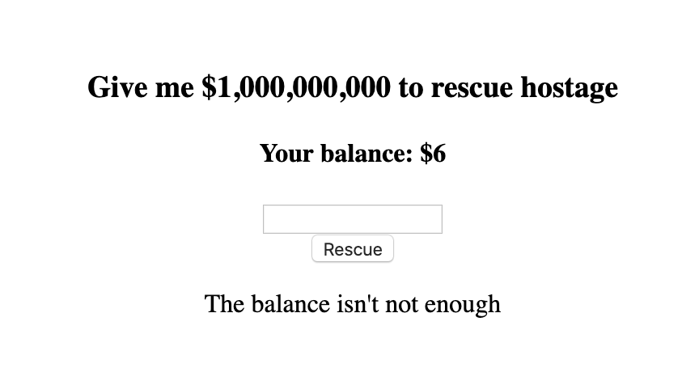

## [We're out of idea, let's call it Web2](https://ctf.viblo.asia/puzzles/we-re-out-of-idea-let-s-call-it-web2-hlygivzyghj)

Thử nhập các số bất kỳ. Nếu nhập số nhỏ hơn balance thì balance sẽ trừ đi và hiện thông báo

Nếu nhập 1 số lớn hơn balance đang có thì

Đề bài yêu cầu đưa 1tỉ đô để giải cứu con tin ???

Theo như những phép thử ở trên thì phép xử lý đơn giản là: nếu số tiền nhỏ hơn số tiền trong tài khoản thì trừ đi => nhập 1 số âm như: -1000000000 hoặc -1000000001 chẳng hạn. Thì code sẽ sử dụng phép trừ:

10 - (-1000000000) = 1000000010. Cuối cùng ta chỉ cần nhập 1000000000 để có thể giải cứu con tin :))

`Flag{ch3ck_3v3rything_th3y_giv3}`

