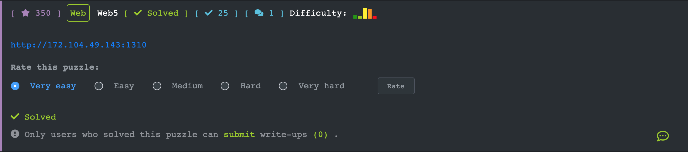
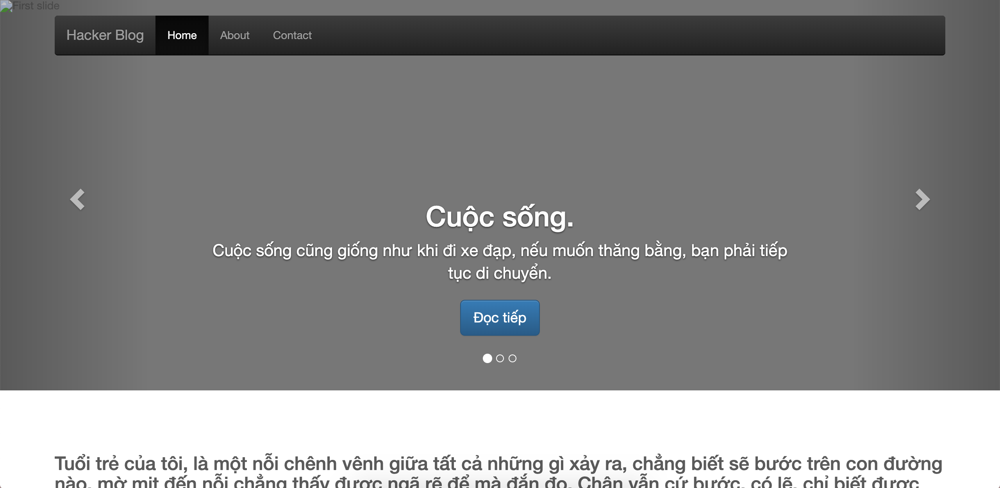
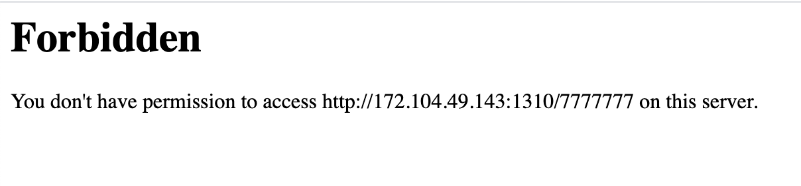
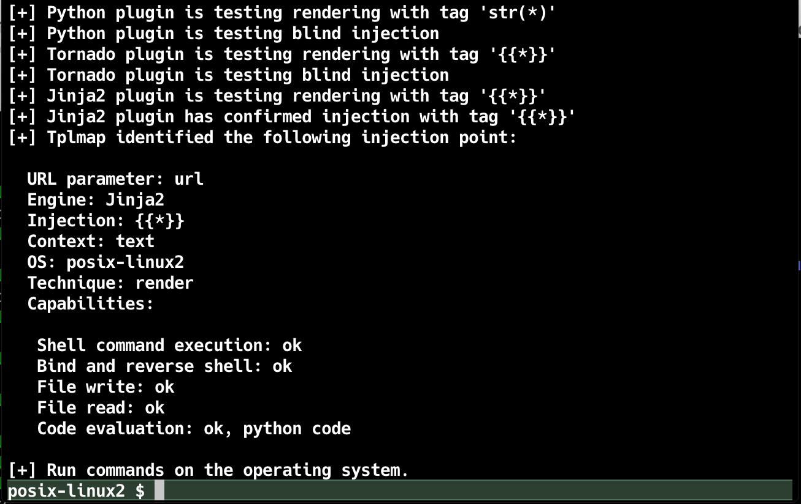
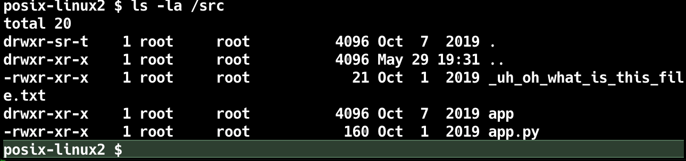
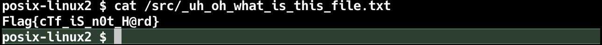

##  [Web5](https://ctf.viblo.asia/puzzles/web5-takknpf4nb2)

Thử 1 vài công cụ và payload, ta nhận định đây là **Templates Injections**, cụ thể là Jinja2 của python

thử payload: {{7*'7’}} ta thu được kết quả như sau:

Ta sử dụng tplmap để tấn công và thực hiện shell

#### `Flag{cTf_iS_n0t_H@rd`}

