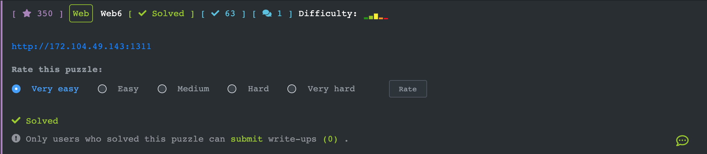
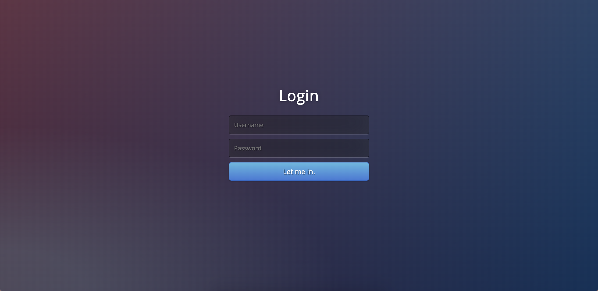
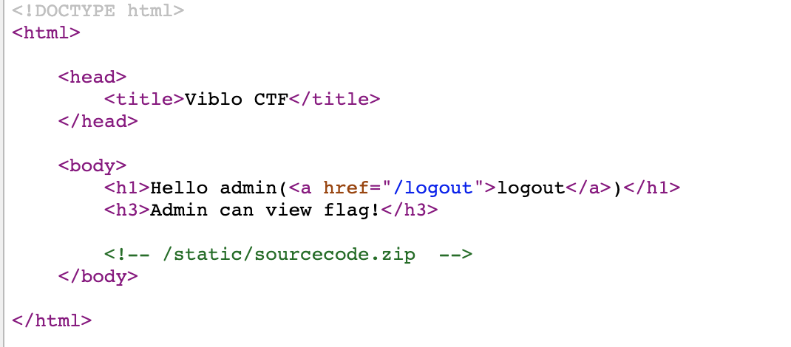
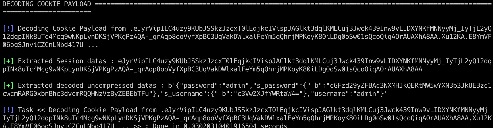
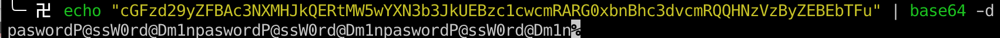
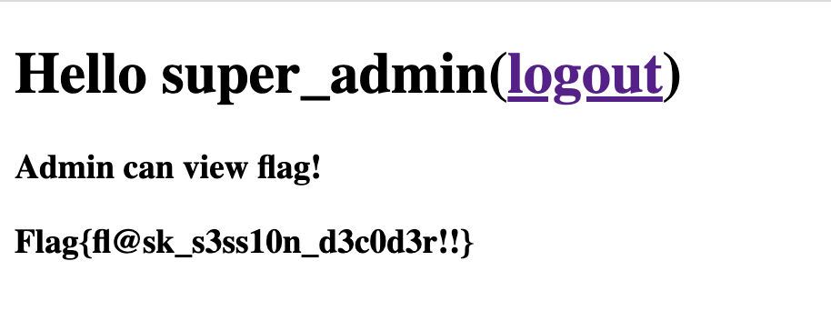

## [Web6](https://ctf.viblo.asia/puzzles/web6-buatn3ebkgn)





Đăng nhập 1 tài khoản bất kì, ở đây mình dùng u=admin&p=admin. Ta thu được như sau:




Nội dung file run.py trong source code. Code bằng flask

```python
from flask import Flask, render_template, session, request, redirect, url_for
from functools import wraps

app = Flask(__name__)
app.secret_key = 'xxx'

def login_required(function):
    @wraps(function)
    def wrap(*args, **kwargs):
        if (not 'username' in session) and (request.endpoint != 'login' and '/static/' not in request.path):
            return redirect(url_for('login'))
        else:
            return function(*args, **kwargs)
    return wrap

@app.route('/login',methods=['GET','POST'])
def login():
    if request.method == "GET":
        return render_template('login.html')
    else:
        username = request.form['u']
        password = request.form['p']
        if 's_username' not in session or 's_password' not in session:
            session['s_username'] = 'xxx'
            session['s_password'] = 'xxx'

        session['username'] = username
        session['password'] = password
        return redirect(url_for('index'))

@app.route('/logout',methods=['GET','POST'])
def logout():
    session.clear()
    return redirect(url_for('login'))

@app.route('/',methods=['GET','POST'])
@login_required
def index():
    if 'username' in session:
        if session['username'] == session['s_username'] and session['password'] == session['s_password']:
            flag = 'xxx'
            return render_template('index.html',session=session,flag=flag)

    return render_template('index.html')

if __name__ == '__main__':
    app.run(debug=True, host='0.0.0.0',port=5000)

```

Nếu session s_username == username và session s_password == password thì ta có thể get được flag

Sử dụng công cụ decode flask cookie ta thu được






Sau khi đăng nhập bằng tài khoản trên ta thu được flag



#### `Flag{fl@sk_s3ss10n_d3c0d3r!!}`

