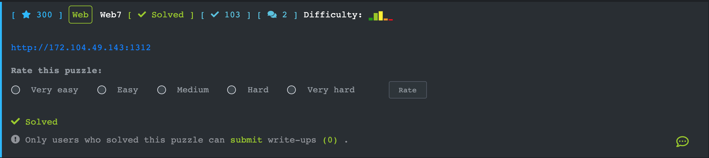
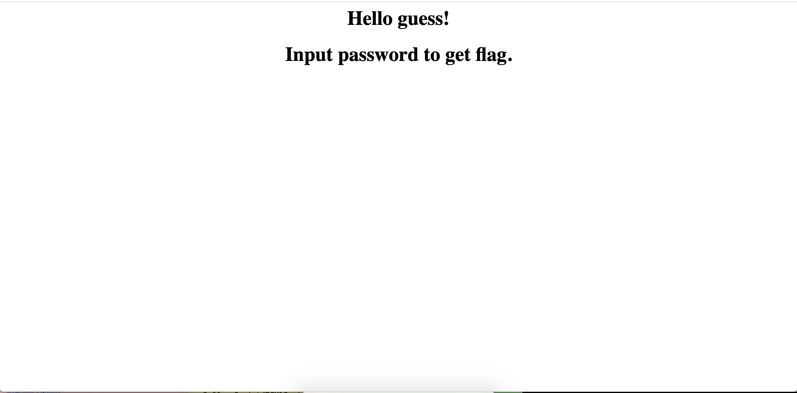
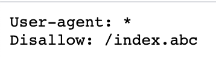
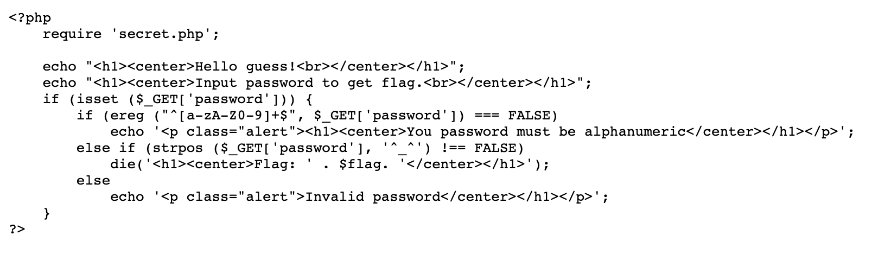

 [Web7](https://ctf.viblo.asia/puzzles/web7-qwevvyc7qkq)

Scan web ta thu được 1 đường dẫn tới file robots.txt. 

Truy cập vào ta nhận được 1 đường dẫn về 1 file đuôi abc, và nó chính là file code của trang index.php

Câu điều kiện thứ nhất kiểm tra xem query có thoả mãn regex không. Regex ở đây có nghĩa là chuỗi chỉ bao gồm các kí tự alphabet thường hoặc hoa, kí tự số, có 1 hoặc nhiều kí tự.

Câu điều kiện số 2 kiểm tra tồn tại vị trí của chuỗi `^_^` trong chuỗi password

Nếu thoả mãn => flag

`Payload: ?password=A%00^_^`

%00 là kí tự null-byte, câu điều kiện thứ nhất gặp kí tự này sẽ kết thúc và không kiểm tra tiếp

`**Flag{POISON_NULL_BYTE}**`

